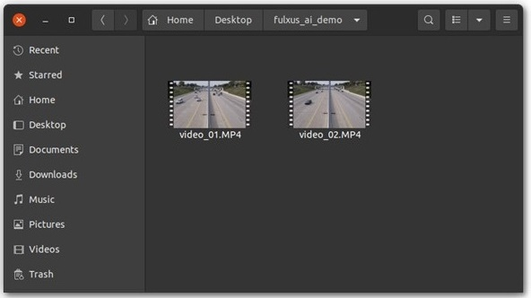
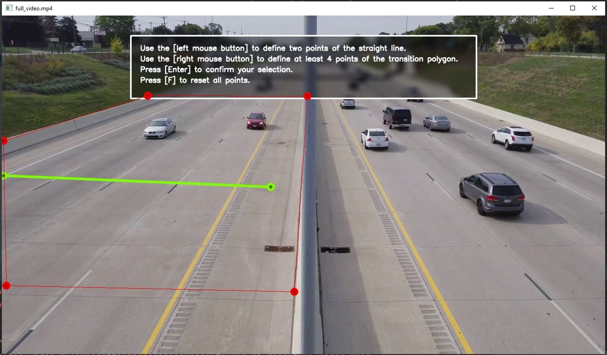
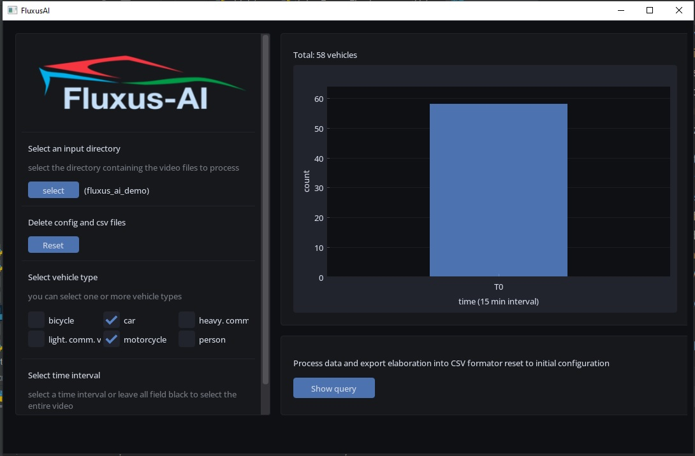

## Fluxus-AI

This repository contains the open source code developed by [Fondazione ITL](https://www.fondazioneitl.org/) and [GoatAI](https://www.goatai.it/) for traffing flow estimation related to the project ["Maritime and MultimOdal Sustainable pAssenger transport solutions and services"](https://www.fondazioneitl.org/en/project/mimosa-maritime-and-multimodal-sustainable-passenger-transport-solutions-and-services/) (MIMOSA).

This Mimosa action is related to the definition of an Artificial Intelligence (AI) tool to estimate traffic flows in a specific area. The AI tool intends to monitor both vehicles (private and public) and person’s flows. The collected data intends to provide an innovative technological tool able to provide in an easier and more cost-efficient way data for the urban mobility planning. The solutions was designed in order to be replicable in others contexts.

### Installation (Windows 10)
- For the first installation, be sure to have an internet connection
- Install Anaconda (https://www.anaconda.com/products/distribution) as the Python interpreter
- Install Git (https://gitforwindows.org/) as the version control software
- Open Anaconda Prompt command line and create new "mimosa" environment `conda create -n mimosa python=3.9`
- Activate the environment `source activate mimosa`
- Clone this repository `git clone https://github.com/berserkrambo/mimosa.git`
- Change dir to root project `cd mimosa` and run the following command `pip install -r requirements.txt`
- Run `pip install torch torchvision --extra-index-url https://download.pytorch.org/whl/cu116` 
- Run the app `python entry_point.py`
- You can also run the application by double clicking `FluxusAI.bat` from the project root folder

### Usage

To use the Mimosa Fluxus-AI application, you first need to properly prepare the videos to be processed. A recording session may consist of several video files, which must be grouped together and placed in an appropriate directory. Consider the example here, in which we have two video files representing 2 consecutive recording sessions of the same area, namely video_01.MP4 and video_02.MP4, both inside a directory named fluxus_ai_demo. To ensure the system operates correctly, it is recommended that each video be given a descriptive name using a common prefix ("video" in our example) followed by a numerical suffix to indicate the time ordering ("_01" and "_02" in or example)". This will help to clearly identify and organize the videos within the system.

Once you have populated the directory with the videos you want to analyze, you can open the Mimosa application and select this directory for processing by pressing the "select" button. At this point, the calibration procedure will start. Specifically, the system will present the user with a frame of the area to be analyzed and request to select the flow line (green), which is the imaginary line on the road that will be used to extract statistics. The statistics will always refer to the time when a vehicle crosses the flow line. Then, the user must delimit the analysis area to a specific portion of the image by selecting an appropriate polygon containing the flow line (red). By excluding areas that are irrelevant to the analysis, you can speed up video processing and make it more efficient. To draw the line an polygon, follow the instructions on-screen:

The system will now begin processing the videos. The results of this processing will be saved in the previously designated directory and will consist of three files: full_video.trk, full_video.dat, and data.csv. The first two files are binary files used exclusively by the Fluxus-AI application and contain the detections and labels extracted with YOLOx and the tracks obtained through the short-term tracking module. The third file, data.csv, is a standard CSV file that can be opened and analyzed with any application that supports this format, such as Microsoft Excel.

Note that, if you select a directory that already contains the data.csv file, you do not need to repeat either the streamline selection step or the video processing step. The Fluxus-AI application is able to display the aggregate statistics based on the queries specified by the user, who can filter the data using numerous parameters including vehicle classes and time intervals. Here, an example of a query is shown, in which the requests to view the vehicular flow in the first 15 minutes of a video, considering only vehicles belonging to the class "car" and the class "motorcycle":

### Acknowledgment

Fluxus AI has been part of the [MIMOSA](https://www.fondazioneitl.org/en/project/mimosa-maritime-and-multimodal-sustainable-passenger-transport-solutions-and-services/) project funded by the European Union’s Italy-Croatia CBC Programme strategic call. MIMOSA aims at improving the offer of multimodal sustainable passengers’ transport solutions and services by promoting a new cross-border approach for passenger mobility in the Italy-Croatia Programme area. This will be achieved through a range of multimodal solutions, innovative smart tools and technologies.

### License
Fluxus AI is licensed under the terms of the MIT license.
